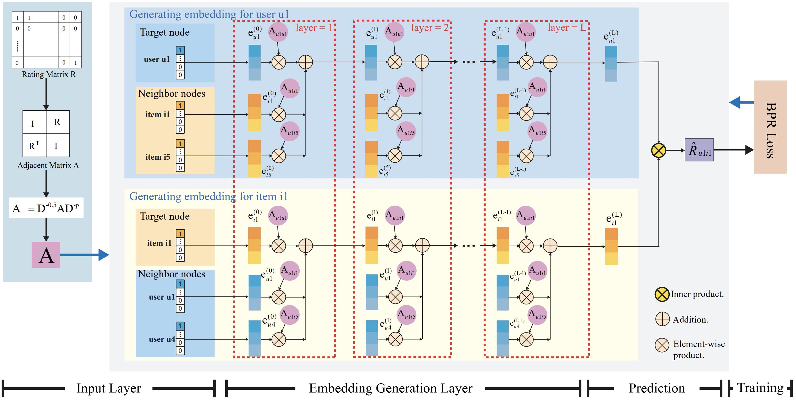

# RGCF
## Refined Graph Convolution Collaborative Filtering with Concise and Expressive Embedding

Graph Convolution Networks(GCNs) have attracted significant attention and have become the most popular method for learning graph representations. In recent years, many efforts have focused on integrating GCNs into recommender tasks and have made remarkable progress. At its core is to explicitly capture the high-order connectivities between nodes in the user-item bipartite graph. 
However, we found some potential drawbacks existed in the traditional GCN-based recommendation models are that the excessive information redundancy yield by the nonlinear graph convolution operation reduces the expressiveness of the resultant embeddings, and the important popularity features that are effective in sparse recommendation scenarios are not encoded in the embedding generation process.

In this work, we develop a novel GCN-based recommendation model, named Refined Graph convolution Collaborative Filtering (RGCF), where a refined graph convolution structure is designed to match  non-semantic ID inputs. In addition, a new fine-tuned symmetric normalization is proposed to mine node popularity characteristics and further incorporate the popularity features into the embedding learning process. Extensive experiments were conducted on three public million-size datasets, and the RGCF improved by an average of 13.45% over the state-of-the-art baseline. Further comparative experiments validated the effectiveness and rationality of each part of our proposed RGCF. 

We provide tensorflow implementation for RGCF.

## prerequisites

- Tensorflow 1.10.0
- Python 3.5
- NVIDIA GPU + CUDA + CuDNN
